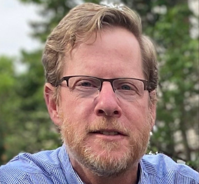

# The CloudForest Team
  
## James Wilgenbusch  

  

  
James (Jim) is responsible for the strategic direction and leadership of the three major computational research areas: the Minnesota Supercomputing Institute (MSI), the University of Minnesota Informatics Institute (UMII), and U-Spatial. In this role he leads University-wide initiatives, partners with collegiate senior administrators and works with faculty and administrators to shape research computing at the University of Minnesota, ensures the excellence of existing activities, and facilitates the implementation of new programs.  Jim is also involved at a regional and national level in the promotion and development of research cyberinfrastructure and plays a variety of roles in organizations such as the Coalition for Academic Scientific Computation (CASC), the Campus Research Computing Consortium (CARCC), and the National Science Foundation’s Big Data Regional Innovation Hubs.  Jim maintains research activities in the study and implementation of models, methods and software used in phylogenetic inference and leads efforts to develop cyberinfrastructure for biological research and research and engineering in general. Jim earned his Ph.D. at George Mason University. For more information about Jim see: https://orcid.org/0000-0001-9464-1578.  
  
## Jeremy Brown  
    
Jeremy bio  
  
## Kyle Gallivan  
    
Kyle bio  
  
## Reid Wagner  
    
Reid is an application developer at the Minnesota Supercomputing Institute (MSI), part of the University of Minnesota. Here he works with researchers in various fields to develop and maintain applications that utilize supercomputing resources. He received his bachelor's degree in Physics & Mathematics in 2014, and after working in a physics lab for one year, he entered the field of software engineering where he remains today. He has worked in multiple software domains including application & web development, system administration, and embedded engineering.  
  
## Benjamin Toups  
    
Benjamin is a PhD Candidate in the Brown Lab at LSU where he studies the origins of gene tree variation. He has diverse interests across biology, programming, and literature!  
  
## Zhifeng Deng
Zhifeng bio

